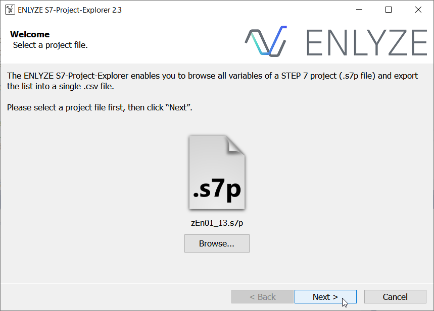

# ENLYZE S7-Project-Explorer

A standalone application for opening a STEP 7 project file (.s7p format) for Siemens S7-300/400 PLCs, browsing through its variables, and exporting the list as a CSV file.

Runs on Windows XP or any later Windows version.

## Screenshots

## Usage

You need to have access to the S7 Project structure, the top level will have a file ending in `.s7p` next to a number of other files and directories. The project explorer
needs to open files from a number of directories, so having just the `.s7p` file alone is not enough.

## Download
Check the [Releases](https://github.com/enlyze/S7-Project-Explorer/releases) page to download the latest version of the S7-Project-Explorer.

## Building
To build the S7-Project-Explorer code, you need **Visual Studio 2019 with Clang**.
This codebase is not yet compatible to any newer Visual Studio version.
Likewise, older Visual Studio versions don't support Clang.

You can download a free Community Edition of Visual Studio 2019 at https://docs.microsoft.com/visualstudio/releases/2019/history

## CSV Format
ENLYZE S7-Project-Explorer exports the variable list in a standardized CSV format.
This file type is suitable for viewing as well as post-processing in another application.

The CSV file has the following table headers:

* _DEVICE_  
  The path to the S7 device/program containing this variable.
  Can be arbitrarily simple or complex depending on your STEP 7 project structure.

  Examples:
  * `S7 Program`
  * `S7-300: My First PLC -> CPU 317-2 DP -> S7 Program`
  * `S7-400: Client S7 400 -> CPU 414-2 DP -> S7 Program`

* _BLOCK_  
  The block that this variable is part of.
  Can be either "Symbol List" or a numbered Data Block (DB).
  If the DB has a name, the name is appended in parentheses.

  Examples:
  * `Symbol List`
  * `DB6 (HMI_Vars)`

* _VARIABLE_  
  The variable name as set in your project.
  Structure variables are flattened in the process.
  Structure variable name and structure field name are separated via a dot.

  Arrays of structures are permuted over all elements.
  This also applies to multi-dimensional arrays of structures.

  Examples:
  * `HeaterOnOff`
  * `StatusStruct.MotorStatus.MotorTemp`
  * `SPArray[0].Velocity`
  * `PVMatrix[1,1].Torque`

* _CODE_  
  The code/address to access this variable.
  Codes from the Symbol List are output in their English form as-is, with e.g. `I` for inputs, `Q` for outputs, and `M` for memory.
  They may be followed by a length indicator, like `W` to indicate a `WORD` data type.

  On the other hand, codes from Data Blocks (DB) always follow the `DBn:a.b` format, where `n` is the DB number, `a` is the byte address within the DB, and `b` is the bit of that byte (nonzero only for `BOOL` variables).

  Examples:
  * `I1.0`
  * `Q5.2`
  * `M76.1`
  * `MW200`
  * `DB6:26.0`

* _DATATYPE_  
  The variable's datatype.
  Can be one of the scalar types or an array of one of the scalar types.
  Multi-dimensional arrays are also supported.

  Note that arrays of struct variables are instead permuted over all their elements (see _VARIABLE_).

  Examples:
  * `BOOL`
  * `WORD`
  * `INT`
  * `ARRAY [0..10] OF INT`
  * `ARRAY [-5..5, 2..3] OF BOOL`

* _COMMENT_  
  Variable description entered in STEP 7.
  May also be prepended by special markers (such as "Struct" to indicate a struct variable) through S7-Project-Explorer.

Note that any warnings emitted while importing the .s7p file are also written into the .csv file.
Warning rows only have information in their _DEVICE_ and _COMMENT_ cells, and all other cells are empty.
This is how you can distinguish them from actual variable rows.

The CSV format output by S7-Project-Explorer uses the `;` delimiter (which is common in Europe for CSV files despite the name).
S7-Project-Explorer also filters out any semicolons or quotation marks from names and comments before writing them into the CSV file.
This obviates the need for putting each cell in quotation marks or escaping any other character, keeping the CSV export code simple.
This way, importing the created file should also be possible using any CSV engine.

## Contact
Deniz Saner ([d.saner@enlyze.com](mailto:d.saner@enlyze.com))

All credits go to Colin Finck ([c.finck@enlyze.com](mailto:c.finck@enlyze.com))
